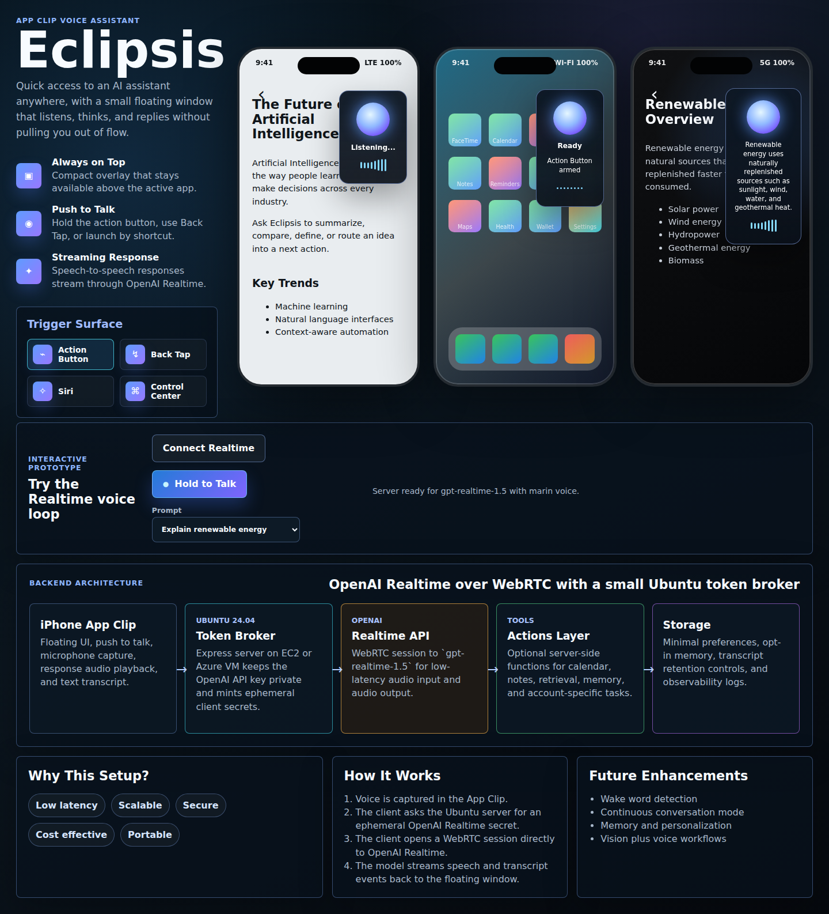

# Eclipsis

<p align="center">
  <strong>Floating voice assistant App Clip prototype</strong><br/>
  Built for realtime, on-device moments with an elegant overlay UI and OpenAI Realtime.
</p>

<p align="center">
  
</p>

---

## 1) Configure the assistant

### Prerequisites
- Node.js 20+
- npm 10+
- OpenAI API key with Realtime access

### Environment setup
```bash
cp .env.example .env
```

Set `OPENAI_API_KEY` in `.env`.

### Realtime model defaults
- Primary model: `gpt-realtime-1.5`
- Cost-aware fallback: `gpt-realtime-mini`

### Local run
```bash
npm install
npm run dev
```

Open: `http://localhost:5173`

If no API key is present, the UI remains fully viewable as a design prototype, but live Realtime connect will be disabled.

---

## 2) Host + expose on a VM (`:4173`)

This project is a single-node Express app with static frontend + token broker.

### Ubuntu VM quickstart
```bash
sudo apt update
sudo apt install -y nodejs npm

git clone <your-repo-url> eclipsis
cd eclipsis
npm install
cp .env.example .env
# edit .env and add OPENAI_API_KEY
PORT=4173 npm start
```

### Open firewall / security group
Allow inbound TCP `4173` from your required CIDR(s).

### Verify health and app
```bash
curl http://127.0.0.1:4173/api/health
curl http://127.0.0.1:4173/
```

### Production recommendation
Use HTTPS termination (Caddy/Nginx) and route `443 -> localhost:4173`.
WebRTC + microphone behavior is more reliable in secure origins.

---

## 3) Comprehensive iOS-side instructions

### iOS capabilities this prototype maps to
- **Action Button trigger** (quick launch gesture)
- **Back Tap trigger**
- **Siri Shortcut trigger**
- **Control Center trigger concept**

### Suggested iPhone-side implementation checklist
1. Create App Clip target + associated domain for your launch URL.
2. Host invocation payload (`appclips:` URL or universal link metadata) on your domain.
3. Add microphone permission strings in Info.plist (`NSMicrophoneUsageDescription`).
4. Implement push-to-talk state machine: `idle -> listening -> streaming -> spoken reply`.
5. Request ephemeral Realtime client secret from `/api/realtime/session` on your VM.
6. Negotiate WebRTC directly from iOS client to OpenAI Realtime using ephemeral secret.
7. Render transcript + voice response in the floating compact UI.
8. Persist only lightweight local context; keep sensitive storage server-side.

### App Clip UX guidance
- Keep first paint under ~1 second for the floating capsule.
- Provide a clear privacy affordance before first mic capture.
- Add a visible fallback if network or token broker is unavailable.
- Offer one-tap “Stop listening” at all times.

---

## Media scripts (👌)

### Generate all App Clip state captures
```bash
npm run screenshot
```

### Generate iPhone wireframe spread (codified montage, local artifact only)
```bash
npm run screenshot:wireframe
```

> The wireframe output is intentionally git-ignored and should not be committed.

### Optional individual captures
```bash
npm run screenshot:board
npm run screenshot:listening
npm run screenshot:ready
npm run screenshot:response
npm run screenshot:desktop
npm run screenshot:mobile
```

Outputs are saved to:
- `screenshots/appclips/`
- `screenshots/eclipsis-desktop.png`
- `screenshots/eclipsis-mobile.png`

---

## Architecture at a glance
1. Client asks broker for ephemeral Realtime credential.
2. Broker (`server/index.js`) calls OpenAI session endpoint with `OPENAI_API_KEY`.
3. Client uses ephemeral secret for direct WebRTC session with OpenAI Realtime.
4. Audio + transcript stream into overlay assistant UI.

---

## Project shape

```text
eclipsis/
  README.md
  index.html
  package.json
  .env.example
  server/
    index.js
  src/
    main.js
    styles.css
  scripts/
    screenshot.js
    wireframe-spread.js
  screenshots/
    appclips/
```
